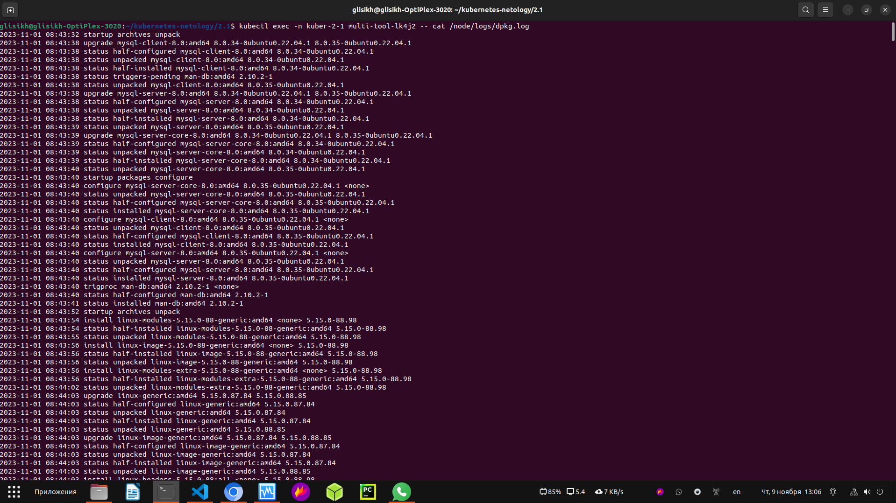

### Домашнее задание к занятию «Хранение в K8s. Часть 1»

## Задание 1

Создать Deployment приложения, состоящего из двух контейнеров и обменивающихся данными.

1. Создать Deployment приложения, состоящего из контейнеров busybox и multitool.

2. Сделать так, чтобы busybox писал каждые пять секунд в некий файл в общей директории.

3. Обеспечить возможность чтения файла контейнером multitool.

4. Продемонстрировать, что multitool может читать файл, который периодоически обновляется.

5. Предоставить манифесты Deployment в решении, а также скриншоты или вывод команды из п. 4.

[yaml манифест первый](https://github.com/george25031996/kubernetes-netology/blob/main/2.1/task1.yml)

## Задание 2

Создать DaemonSet приложения, которое может прочитать логи ноды.

1. Создать DaemonSet приложения, состоящего из multitool.

2. Обеспечить возможность чтения файла /var/log/syslog кластера MicroK8S.
т.к. в этой папке на Ноде пусто, смонтировал на папку выше /var/log

3. Продемонстрировать возможность чтения файла изнутри пода.

4. Предоставить манифесты Deployment, а также скриншоты или вывод команды из п. 2.

[yaml манифест второй](https://github.com/george25031996/kubernetes-netology/blob/main/2.1/task2.yml)
