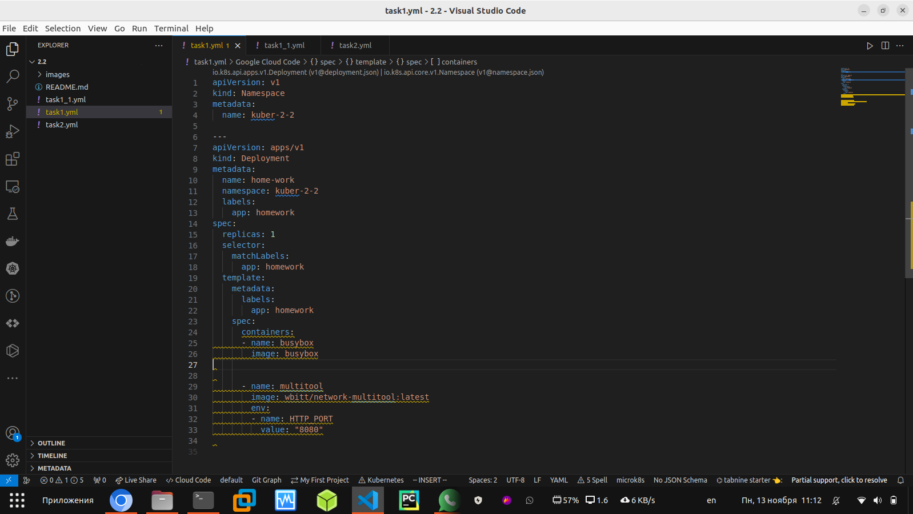
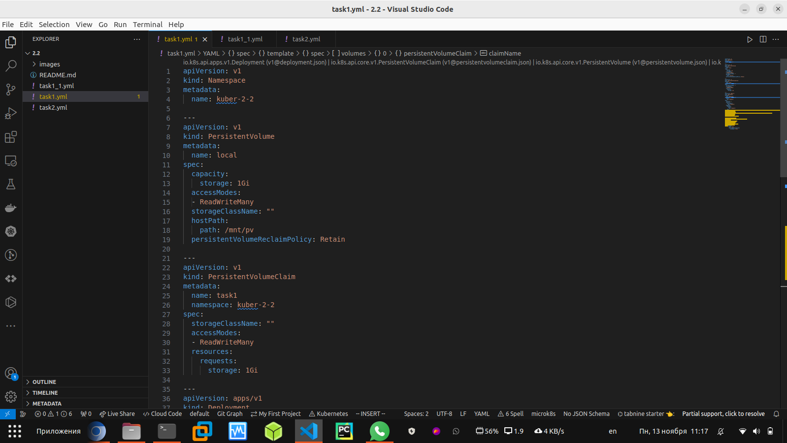
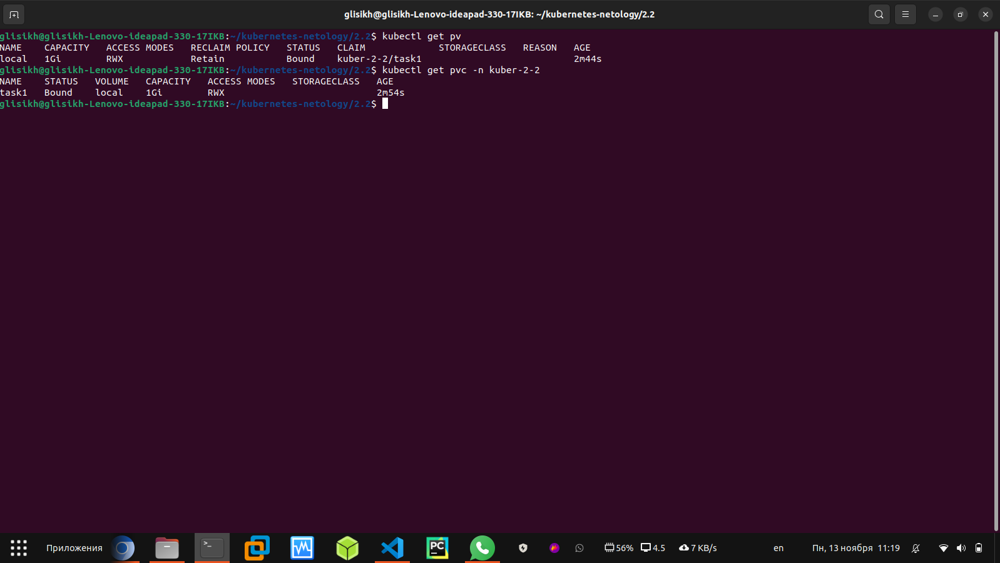
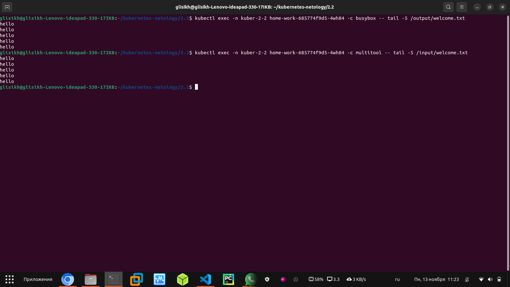
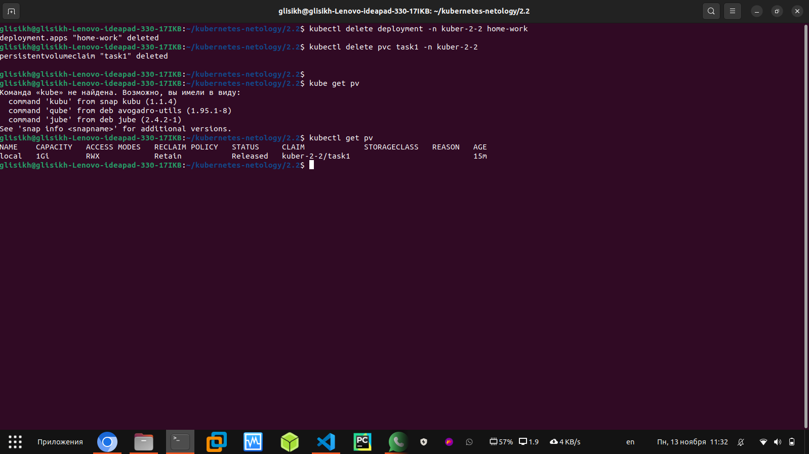
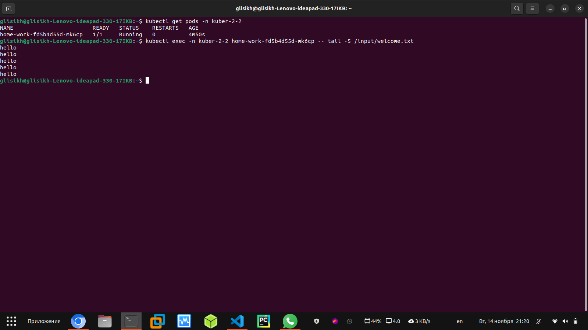
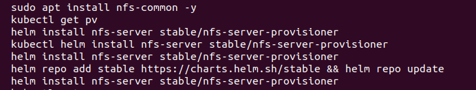
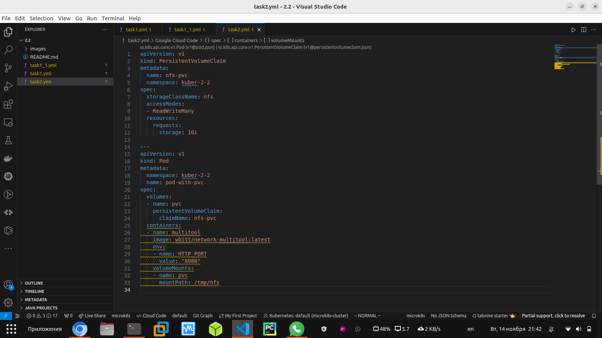
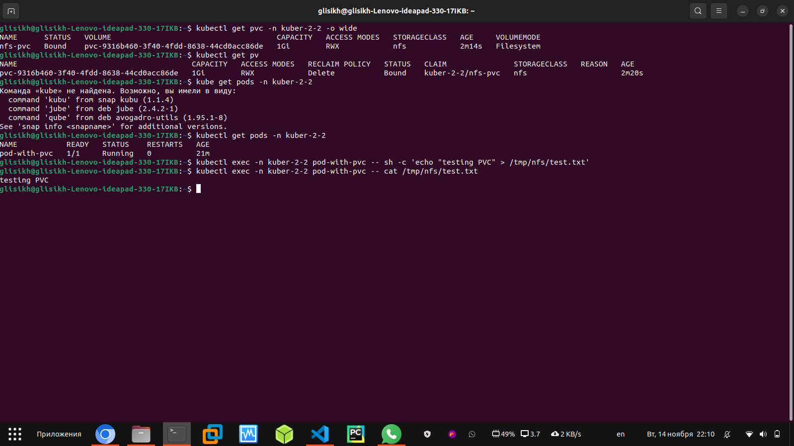

### Домашнее задание к занятию «Хранение в K8s. Часть 2»

## Задание 1

Создать Deployment приложения, использующего локальный PV, созданный вручную.

1. Создать Deployment приложения, состоящего из контейнеров busybox и multitool.

2. Создать PV и PVC для подключения папки на локальной ноде, которая будет использована в поде.

3. Продемонстрировать, что multitool может читать файл, в который busybox пишет каждые пять секунд в общей директории.

4. Удалить Deployment и PVC. Продемонстрировать, что после этого произошло с PV. Пояснить, почему.

# Пояснение:

На лекции при демонстрации материала, во время удаления PVC терминал "завис", до тех пор, пока не был удалён POD использующий PVC. У меня при выполнении ДЗ, во время удаления деплоймента удалился и под, поэтому зависания не произошло. А PV перешёл в статус "Освобождён"

5. Продемонстрировать, что файл сохранился на локальном диске ноды. Удалить PV. Продемонстрировать что произошло с файлом после удаления PV. Пояснить, почему.

# Не нашёл как подключиться на ноду Microk8s, поэтому чуть исправил деплоймент (убрал контейнер Busybox) и запустил его повторно.

# Как видно из вывода ниже, при повторном создании PV и подключении PVC(по тому же пути, что и в предыдущем задании), данные в нём сохраняются без изменений.

## Задание 2

Создать Deployment приложения, которое может хранить файлы на NFS с динамическим созданием PV.

1. Включить и настроить NFS-сервер на MicroK8S.

2. Создать Deployment приложения состоящего из multitool, и подключить к нему PV, созданный автоматически на сервере NFS.

3. Продемонстрировать возможность чтения и записи файла изнутри пода

4. Предоставить манифесты, а также скриншоты или вывод необходимых команд.

