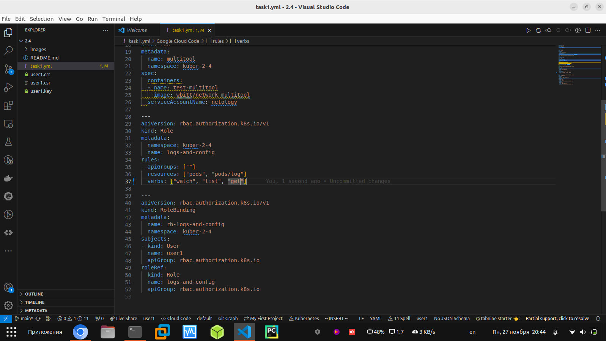

### Домашнее задание к занятию «Управление доступом»

В тестовой среде Kubernetes нужно предоставить ограниченный доступ пользователю.

## Задание 1. Создайте конфигурацию для подключения пользователя

1. Создайте и подпишите SSL-сертификат для подключения к кластеру.

2. Настройте конфигурационный файл kubectl для подключения.

3. Создайте роли и все необходимые настройки для пользователя.

4. Предусмотрите права пользователя. Пользователь может просматривать логи подов и их конфигурацию (kubectl logs pod <pod_id>, kubectl describe pod <pod_id>).

5. Предоставьте манифесты и скриншоты и/или вывод необходимых команд.

[yaml манифест](https://github.com/Rain-m-a-n/devops-netology/blob/master/%D0%9A%D0%BE%D0%BD%D1%84%D0%B8%D0%B3%D1%83%D1%80%D0%B0%D1%86%D0%B8%D1%8F%20Kubernetes/Kuber_(2.4)/task.yml)
