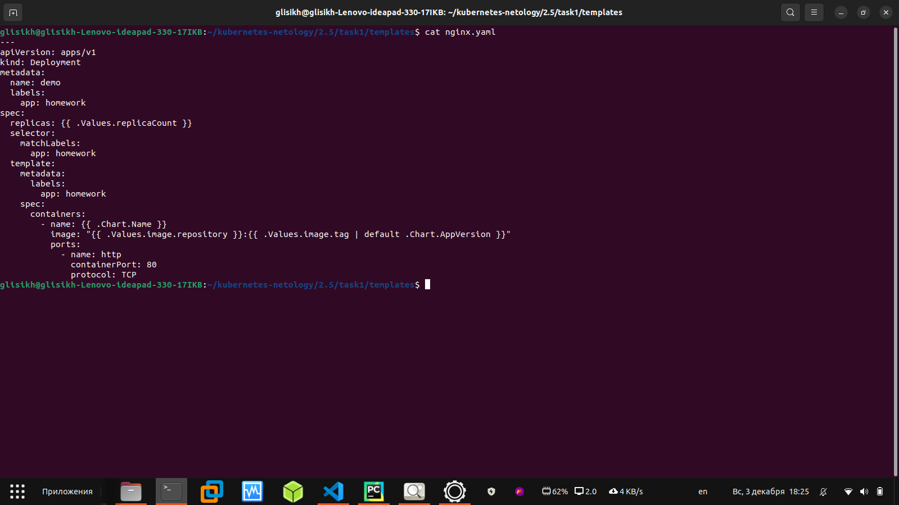

### Домашнее задание к занятию «Helm»

## Задание 1. Подготовить Helm-чарт для приложения

1. Необходимо упаковать приложение в чарт для деплоя в разные окружения.

2. Каждый компонент приложения деплоится отдельным deployment’ом или statefulset’ом.

3. В переменных чарта измените образ приложения для изменения версии

Решение:

1. Сначала я выполнил команду helm create task1

2. В папке task1/templates/ я создал файл nginx.yaml (Конфигурационный файл для Nginx):

2. В папке task1/templates я создал файл service.yaml:

3. Отредактрировал в папке task1 два файла: Chart.yaml и values.yaml

3. Теперь можно посмотреть, что появилось в nginx.yaml:

4. Теперь я изменяю образ на другой:

6. Смотрю изменённый образ в task1/templates/nginx.yaml:

## Задание 2. Запустить две версии в разных неймспейсах

1. Подготовив чарт, необходимо его проверить. Запуститe несколько копий приложения.

2. Одну версию в namespace=app1, вторую версию в том же неймспейсе, третью версию в namespace=app2.

3. Продемонстрируйте результат.

Решение:

1. Проверил чарт и запустил несколько копий приложения:

2. Сделал одну версию в namespace=app1, вторую версию в том же неймспейсе, третью версию в namespace=app2:

